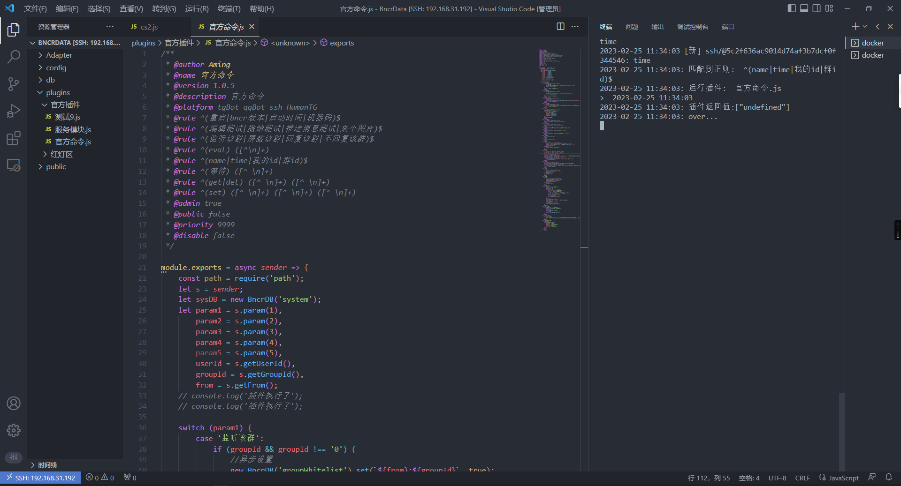

> -   Bncr 是一个 Node.js 框架，开发框架需要有一定的 JavaScript 和 Node.js 基础。
> -   本人用傻妞(sillyGirl)比较多一点，习惯了一些语法与功能，所以 Bncr 上有很多傻妞语语法的身影~ 如果你是一个傻妞开发者，切换至 Bncr 可以说是无缝切换！

# 开发环境搭建

## 通过 vscode 远程开发

-   百度 `vscode 安装 Remote-SSH` 并链接远程主机
-   打开 BncrData 映射目录
-   新建终端,输入 docker attach bncr 链接容器控制台,在这里你可以直接输入信息调试、以及观察 console.log 输出信息、收发消息情况等信息
-   npm/yarn： 你可以直接在根目录下新建终端，直接 `npm/yarn i xxx` ，如果本机没有 npm/yarn 环境，可以 `docker exec -it bncr /bin/sh` 后 `npm/yarn i 你的内容 `
-   本人开发姿势：两个终端，一个 `docker attach bncr` 用于调试，另一个 `docker exec -it bncr /bin/sh` 用于安装 npm，这样开发插件非常方便~
     本人开发插件示例

## 文件目录说明

-   适配器开发

    -   Adapter 下只有根目录下的.js 文件才会被尝试载入，二级以下的目录不会加载
    -   重载：适配器本身开发需求并不是太大，所以没有做热重载，需要重启重载

-   插件开发

    -   注意 与 Adapter 不同，因为要做作者分类或者作用域分类，所以 plugins 下只有二级目录下的.js 文件才会被尝试载入，根目录以及 3 级以下不会加载，示例 ：

        ```
        plugins/官方插件/命令.js  //会被当做插件载入
        plugins/命令.js  //忽略
        plugins/官方插件/mod/qlmod.js //忽略 因此你可以在三级目录放一些自己写的模块
        ```

    -   重载：plugins 下的所有文件都是保存既重载

-   静态资源
    -   public 目录下的文件将被作为静态资源公开，访问 `http://ip:9090/public/对应文件名` 即可访问到，因此，你可以操控 bncr 把文件存放到该目录，在通过本机 url 的方式发送出去（建议用 uuid 或其他随机数来表示文件名，否则资源多的情况下可能会导致误发文件）。

# 全局方法介绍

## router 系统路由
该路由基于express.Router()，挂载在系统api/路径下,你可以在9090/api/下扩展服务
```js
//示例
// get访问http://bncrip:9090/api/qq/ws 
router.get('/qq/ws', (req, res) => {
    res.send({ msg: '这是Bncr 外置qq Api接口，你的get请求测试正常~，请用ws交互数据' });
});
// post访问http://bncrip:9090/api/qq/ws 
router.post('/qq/ws', async (req, res) => {
    res.send({ msg: '这是Bncr 外置qq Api接口，你的post请求测试正常~，请用ws交互数据' });
});
// ws监听ws://bncrip:9090/api/qq/ws 
router.ws('/qq/ws', ws => {
    ws.on('message', msg => {
        console.log('收到ws请求', msg);
    });
});
```

## sysMethod 系统方法

### async sysMethod.sleep(time)

休眠(阻塞运行),传 number,注意单位是秒

```javascript
//休眠5秒 不用await 关键字无效
await sysMethod.sleep(5);
```

### sysMethod.getTime(string)

获取时间

```javascript
sysMethod.getTime('hh:mm:ss'); //18:19:20
sysMethod.getTime('yyyy-MM-dd'); //2023-02-24
sysMethod.getTime('yyyy-MM-dd hh:mm:ss'); //2023-02-24 18:19:20
```

### sysMethod.config

存储着 config.js 下的全部信息

### sysMethod.cron

#### sysMethod.cron.newCron(string,()=>{})

系统内置的定时器

```javascript
//8点执行回调函数
sysMethod.cron.newCron('0 0 8 * * *', () => {
    console.log('执行了');
});
```

#### sysMethod.cron.isCron(string)

判断字符串是否是定时表达式

```javascript
sysMethod.cron.isCron('0 0 8 * * *'); //true
sysMethod.cron.isCron('* * *'); //false
```

### sysMethod.inline(string)

内联
以系统管理员的身份向平台内部发送消息

```js
//例子 9点整以系统管理员身份 触发重启命令 from类型为system
sysMethod.cron.newCron('0 0 9 * * *', () => {
    sysMethod.inline('重启');
});
```

### sysMethod.push(pushInfo)

系统推送消息方法

```javascript
//通过tgBot向用户或者群发消息
//群id和个人id必须存在一个,否则不会推送消息,如果同时存在,则群和人都推
// type为可选字段,如果不传该值默认为text
sysMethod.push({
    platform: 'tgBot',
    groupId: `-1001704263871`,
    userId: `1629887728`,
    msg: '这是一条推送消息',
    type: 'text',
});
```

### sysMethod.pushAdmin(pushInfo)

通知各个适配器管理员

```javascript
//必选字段
//[platform]需要推送平台的sting数组,如果为空数组,则会推送所有平台.
//[msg]要发送的消息
//可选字段
//[type],发送消息的类型,默认为text
sysMethod.pushAdmin({
    //推送所有平台
    platform: [],
    //只推送wxKeAImao 、qqbot 、tgBot
    platform: ['wxKeAImao', 'qqbot', 'tgBot'],
    msg: '这是一条推送消息',
});
```

```javascript

```

## Adapter ( ) 适配器构造函数

-   具体使用方法参见适配器开发

## BncrDB ( ) 系统数据库构造函数

系统数据库为轻量型内嵌式 KV 数据库。

开发插件时，你可以使用任意你喜欢的数据库来存放数据 （不建议，会破坏用户使用体验）

有关数据库操作，你可以在官方插件中找到全部用法示例

> 警告! db文件可能看起来是json格式文件，但实则不是！不要试图用任何工具直接修改db文件，这可能会造成数据损坏!

### get()获取数据

该方法接受三个参数

-   需要读取的 key
-   未读取到值默认返回值（可选）
-   布尔值，默认 false，true 返回该数据的全部数据 （可选）

```javascript
//创建一个系统数据库实例
const sysdb = new BncrDB('system');

//读取一个key的 value 值 如果没有该数据返回undefined
await sysdb.get('name1'); // undefined
// 第二个参数作为未读取到数据的返回值
await sysdb.get('name1', '空值'); // 空值
// 读取到数据 返回 value 值
await sysdb.get('name', '空值'); // Aming

// 读取该数据数据结构
await sysdb.get('name', '空值', true);
/** 如果读取到数据返回以下结构，否则返回第二个参数
    {
        name: 'system',
         key: 'name',
         value: 'Aming',
         _id: 'pptOvhDn8rOyb3m4',
         createdAt: 2023-02-17T14:15:33.246Z,
         updatedAt: 2023-02-17T14:29:31.197Z
    }

*/
```

### set()存储数据

该方法接受三个参数

-   需要设置的 key
-   需要设置的 value
-   可选参数 （可选）

```javascript
//创建一个系统数据库实例
const sysdb = new BncrDB('system');

await sysdb.get('name'); // Aming
await sysdb.set('name', 'Aming3'); // 成功 true 失败false
await sysdb.get('name'); // Aming3

//第三个参数为对象，如果传入def字段，则改变设置成功返回的值 ，该对象还有一些其他的字段可设置，还在开发ing...
await sysdb.set('name', 'Aming4', { def: '设置成功' }); // 成功 设置成功 失败 false
await sysdb.get('name'); // Aming4

//其他使用
//异步设置，不会阻塞程序执行，如果需要等待设置结果，此方法不可用
sysdb.set('name', 'Aming5'); // 返回一个Promise
//注意！set操作可以设置任何Object Number Array等js值，不会将value转为字符串设置进数据库，get读取到的和设置时的相同。
```

### del()删除数据

该方法接受两个参数

-   需要删除的 key
-   删除成功返回的值

同 get 使用相同，删除成功返回 true，有第二个参数则返回第二个参数，失败返回 false ，没有该值会返回 undefined

### keys()读取所有 key

返回一个字符串数组

# 适配器开发

## 元信息配置

通过 jsdoc 注释的方式来定义元信息

```javascript
/**
 * 作者
 * @author Aming
 * 适配器名称
 * @name HumanTG
 * 组织名  预留字段，未来发布插件会用到
 * @origin 官方
 * 版本号
 * @version 1.0.0
 * 说明
 * @description 适配器
 * 只有该值为true才会被作为适配器载入
 * @adapter true
 * 是否发布该插件（预留）
 * @public false
 * 是否禁用，true时该适配器不会被载入
 * @disable false
 * 载入优先级
 * @priority 101
 * 版权信息
 * @Copyright ©2023 Aming and Anmours. All rights reserved
 * Unauthorized copying of this file, via any medium is strictly prohibited
 */
```

## 初始化一个适配器

在本框架下，所有插件都必须遵循 CommonJS 模块化规范导出一个函数作为启动入口

例:

```javascript
//当导出的函数为async异步函数时，系统载入该适配器的时候会 await 等待该异步结束才会加载下一个适配器
module.exports = async () => {
  //you code
}

// 上面的代码等同于

module.exports = () => {
  return new Promise(async (resolve, reject) => {
    //you code
  }
}
```

或：

```javascript
async function mian () {
  //you code
}

// 上面的代码等同于
function mian () {
  return new Promise(async (resolve, reject) => {
    //you code
  }
}

module.exports = mian

```

基本使用方法：

```javascript
/**
 * @author Aming
 * @name 钉钉
 * @origin 官方
 * @version 1.0.0
 * @description 钉钉适配器
 * @adapter true
 * @public false
 * @disable false
 * @priority 50
 * @Copyright ©2023 Aming and Anmours. All rights reserved
 * Unauthorized copying of this file, via any medium is strictly prohibited
 */

module.exports = () => {
    //实例化一个适配器，传入名，该名会作为唯一标识符，所以请避免和其他适配器冲突
    const Ding = new Adapter('Ding');
    /* 注入发送消息方法 */
    /* 
    replyInfo 为固定结构：
    该结构中的内容完全于插件内sender.reply()函数决定，详细参见插件开发说明
    replyInfo = {
        type: 'text', //image/video/ 等
        msg: '要发送的消息',
        userId: '发送的用户id',
        groupId: '发送的群id',
        toMsgId: '发送者的消息id',
    }
    */
    Ding.reply = async function (replyInfo) {};
    /* 注入推送消息方法 */
    Ding.push = async function (replyInfo) {};
    /* 注入删除消息方法 */
    /* args = string[] */
    Ding.delMsg = async function (args) {};

    //向框架内部发送信息，以下除了type都是必填字段,如果是number或其他值必须全部转为string
    Ding.receive({
        userId: '用户id' || '',
        userName: '用户名' || '',
        groupId: '群id' || '0',
        groupName: '群名' || '',
        msg: '消息' || '',
        msgId: '消息id' || '',
        type: `Social`, //消息类型（预留字段，可不填）Social意为社交
    });

    //最后必须返回该实例对象
    return Ding;
};

//详细适配器开发请见bncr官方自带的适配器
```

# 插件开发

## sender 方法合集

开发插件前,我们先了解一下 sender,该方法只有在插件中可用

### sender.getMsg() 获取消息

### sender.setMsg() 篡改消息

### sender.getMsgId() 获取消息 id

### sender.getUserId() 获取用户 id

### sender.getUserName() 获取获取用户名

### sender.getGroupId() 获取群消息 id

### sender.getGroupName() 获取群名

### sender.getFrom() 获取来自什么平台

### sender.param() 提取触发词中的$x

### async sender.isAdmin() 是否管理员消息

```javascript
await sender.isAdmin(); //true or false
```
### sender.inlineSugar(msg) 内联
代替用户触发消息(发送消息)
```javascript
await sender.inlineSugar('重启');  //代替用户发送重启命令
```

### async sender.delMsg() 删除/撤销消息

```javascript
//立即撤回消息
sender.delMsg('id1', 'id2');

//等待2秒 阻塞
await sysMethod.sleep(2);
sender.delMsg('id1', 'id2');
/* 上下两种方法等价 */
//等待2秒 阻塞
await sender.delMsg('id1', 'id2', { wait: 2 });

//异步非阻塞 会挂载到后台等待，继续运行下面的代码
sender.delMsg('id1', 'id2', { wait: 2 });
```

### async sender.reply() 回复消息

```javascript
let s = sender;
//方式1
await s.reply('发送的消息');
//方式2
await s.reply({
    msg: '发送的消息',
});
//方式3
await s.reply({
    type: 'text',
    msg: '发送的消息',
});
//如果只发送字符串这三种写法是等价的 ,不指定消息类型默认是text

// 他们的区别在于可以指定发送消息的类型
await s.reply({
    type: 'image', // video
    msg: 'https://tse4-mm.cn.bing.net/th/id/OIP-C.YKoZzgmubNBxQ8j-mmoTKAHaEK?pid=ImgDet&rs=1',
});

//进阶
let replyid = await s.reply({
    type: 'image', // video
    msg: 'https://tse4-mm.cn.bing.net/th/id/OIP-C.YKoZzgmubNBxQ8j-mmoTKAHaEK?pid=ImgDet&rs=1',
    userId: '发给谁', //不传该字段默认是收到消息的人
    groupId: '发给群id', //不传该字段默认是收到消息的群
    toMsgId: '回复的消息id', //不传该字段默认是收到消息id
});
//撤回刚刚发的消息
await sender.delMsg(replyid);
```

### async sender.waitInput(()=>{},time) 监听消息

与

### async sender.again()

```javascript
// 第一个参数必须为函数，第二个参数为时间，单位秒，
// 监听到该用户继续发信息时，会触发回调函数，返回一个 新的sender
// 监听该用户从新输入信息，等待30秒，
let newMsg =  await sender.waitInput(()=> {}, 30)
//超时未发送 newMsg = null
newMsg.getMsg()//获取监听到的信息

/* 进阶 */
// 回调函数中return 'again'会再次监听，并且监听时间重置为设定的时间
// again()方法会调用reply方法把传过去的值发送一遍，强制返回"again" ，所以是上述语法糖
// 因此以下回调函数中两种消息分支是等价的
let phone = await sender.waitInput(async (s)=> {
    //手机号
    let num = sender.getMsg();
    if (num === 'q') {
    } else if (num - 1 !== num - 1) {
        await s.reply('错误,重新输出')
        return 'again'                  //等价
    } else if (num.length !== 11) {
        return await s.again('错误,重新输出');  //等价
    }
}, 30);
if (phone === null) return sender.reply('超时退出');
if (phone.getMsg() === 'q') return sender.reply('已退出');
//撤回用户发的信息
sender.delMsg(phone.getMsgId();)

```

## 元信息配置

```js
/**作者
 * @author Aming
 * 插件名
 * @name 官方命令
 * 组织名  预留字段，未来发布插件会用到
 * @origin 官方
 * 版本号
 * @version 1.0.5
 * 说明
 * @description 官方命令
 * 限制平台 不在该范围内的平台消息该插件不会被触发
 * @platform tgBot qqBot
 * 触发正则   在bncr 所有的rule都被视为正则
 * @rule ^(重启|bncr版本|启动时间|机器码)$
 * @rule ^(编辑测试|撤销测试|推送消息测试|来个图片)$
 * @rule ^(监听该群|屏蔽该群|回复该群|不回复该群)$
 * @rule ^(eval) ([^\n]+)
 * @rule ^(name|time|我的id|群id)$
 * @rule ^(等待) ([^ \n]+)
 * @rule ^(get|del) ([^ \n]+) ([^ \n]+)
 * @rule ^(set) ([^ \n]+) ([^ \n]+) ([^ \n]+)
 * // 是否管理员才能触发命令
 * @admin true
 * // 是否发布插件，预留字段，可忽略
 * @public false
 * // 插件优先级，越大优先级越高  如果两个插件正则一样，则优先级高的先被匹配
 * @priority 9999
 * // 是否禁用插件
 * @disable false
 * // 每5小时运行一次插件
 * @cron 0 0 *\/5 * * *
 * // 是否服务模块，true不会作为插件加载，会在系统启动时执行该插件内容
 * @service false
 */
```

## 初始化一个插件

在本框架下，所有插件都必须遵循 CommonJS 模块化规范导出一个函数作为启动入口
@service true 除外

例:

```javascript
//当导出的函数为async异步函数时，系统运行插件时候会 await 等待该异步结束才会加载判断是否运行下一个插件
// 上面学到的 sender 在这时候用到，运行插件时，会传递sender进来~
module.exports = async (sender) => {
  //you code

  //插件运行结束时 如果返回 'next' ，则继续向下匹配插件 否则只运行当前插件
  return 'next'  //继续向下匹配插件
}
// 上下两种写法是等价的
module.exports = (sender) => {
  return new Promise(async (resolve, reject) => {
    //you code

    //插件运行结束时 如果返回 'next' ，则继续向下匹配插件 否则只运行当前插件
    resolve('next') //继续向下匹配插件
  }
}
```

或：

```javascript
async function mian () {
  //you code

  //插件运行结束时 如果返回 'next' ，则继续向下匹配插件 否则只运行当前插件
  return 'next'  //继续向下匹配插件
}
// 上下两种写法是等价的
function mian () {
  return new Promise(async (resolve, reject) => {
    //you code

    //插件运行结束时 如果返回 'next' ，则继续向下匹配插件 否则只运行当前插件
    resolve('next') //继续向下匹配插件
  }
}

module.exports = mian
```

## 写一个简单的 hello world

```js
/**作者
 * @author Aming
 * @name 官方命令
 * @version 1.0.5
 * @description 官方命令
 * @rule ^(hello|你好) ([^ \n]+)$
 * @admin true
 * @public false
 * @priority 1
 * @disable false

 */
module.exports = async s => {
    /* 
   rule ^(hello|你好) ([^ \n]+)$
  上面的rule定义 发送:
  hello 任何值
  你好 任何值 
  都会触发该插件
  */

    /* 如果是发送的 hello bncr 且 消息平台来自于tgBot 则回复 hello world  */
    if (s.param(1) === 'hello' && s.param(2) === 'bncr' && s.getFrom() === 'tgBot') {
        await s.reply('hello world');
    }
};
```

## 插件加密

为保护开发者知识产权，如果不想公开插件源码，可以用块级注释来包裹需要加密的内容  
`/* HideStart */` 开始，`/* HideEnd */`结束，必须严格按照要求，多/少空格都不会被识别到  
如果插件中有加密块注释，保存时会在插件对应的目录中生成 EncryptFiles 目录，下面存放着加密后的插件，将此插件发布出去，用户使用时并不影响执行效果

```js
/* HideStart */
let key = 1234;
/* HideEnd */

console.log('key');
```

到底啦~ 详细的开发还是要靠插件来说明,多看看官方插件吧~~
